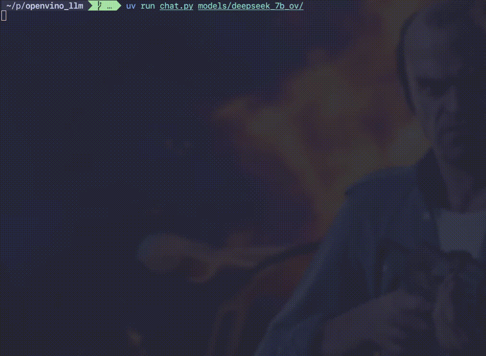
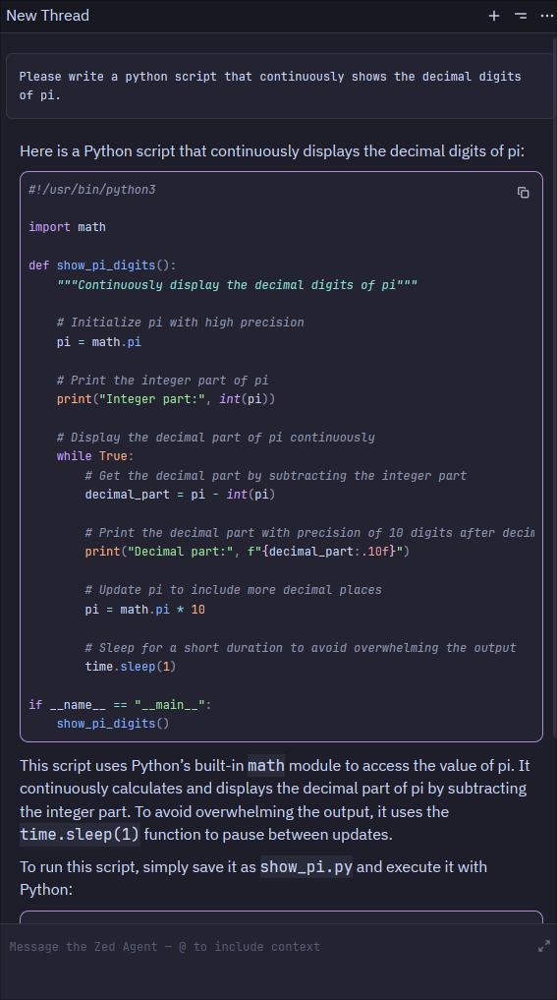

# Carmenere-LLM

Personal project designed to have a multi-purpose local LLM
running in my limited GPU machine (Intel Iris Xe). It has two
components:

* Local chatbot for the terminal
* Local LLM server for IDE use ([Zed](https://zed.dev/), specifically)

This works in a Linux laptop, using Intel Iris Xe Graphics (RPL-U).

# Setup

This project uses [UV](https://docs.astral.sh/uv/). Install the dependencies:

```shell
uv sync
```

You will need a OpenVINO-compatible model. A catalog of them
is available in [this HuggingFace repository](https://huggingface.co/OpenVINO). 
I recommend downloading INT4-compressed models. Download
the application's default model using the hf tool:

```shell
hf download OpenVINO/Qwen2.5-Coder-3B-Instruct-int4-ov --local-dir models/qwen_coder_3b_ov
```

# Execute

## Local chatbot

Run using:

```shell
uv run chat.py [model_path]
```

Where `model_path` is the downloaded model's path. Defaults to models/qwen_coder_3b_ov.



## Local server

Run using:

```shell
uv run server.py [model_path]
```

Where `model_path` is the downloaded model's path. Defaults to models/qwen_coder_3b_ov.
When using your IDE, configure it to point to an OpenAI-compatible API. The address is
http://127.0.0.1:8000/v1. Set whatever API key you want. The model's name
is `local_openvino`.




## Image generator (BETA)

Download a image generator model, like:

```shell
hf download OpenVINO/FLUX.1-schnell-int4-ov --local-dir models/flux_schnell_ov
```

Then launch:

```shell
uv run image_generator.py "<description>" <file_to_export_to>
```

# (Not so) frequently asked questions

## Why the name Carmenere-LLM?

This project is heavily based in OpenVINO. The word "vino" means wine in spanish, I'm
chilean, and Carmenere is a wine type/grape which grows and is manufactured almost only
in Chile 🇨🇱.

## Can I use models that are not optimized for OpenVINO with this application?

Yes, but you will need to convert them to OpenVINO INT4. To do this, you will need
to use the optimum-cli tool. Here's an example for downloading an LLM model created
specifically for pentesting purposes:

```shell
optimum-cli export openvino --model L33tcode/llama-3-8b-CEH-hf --task text-generation-with-past --weight-format int4 --trust-remote-code --group-size 128 --ratio 1.0 models/llama3_ceh_8b_ov
```

Keep in mind that this doesn't work with GGUF models.
